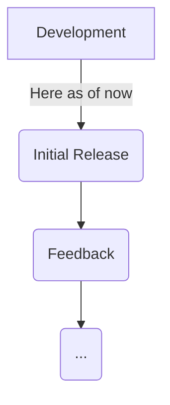

# calendar.nvim

A nvim plugin with a calendar and note feature to manage notes and dates.

# Progress

# Why

A lot of people including myself have loved the feature rich environment of nvim so much that we want to daily drive it for
everything. This has lead to me before my first year in uni to start creating an environment which I want to take notes and
program in. To do that, I need a calendar to manage daily todos and be sure that I don't forget somethings in nvim. This is
where `calendar.nvim` is made.

# Project Structure

If you know nvim plugins, `/lua` is the file with most of the logic that is run by the user, while `/plugin` is runned on start up.

## In `/lua`:
- `calendar.lua` is the main file that merges all of the files
- `file.lua` manages the files saving for the daily notes
- `view.lua` creates the UI for the calendar
- `window.lua` is the window manager for calendars and writing interfaces
